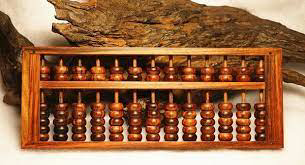
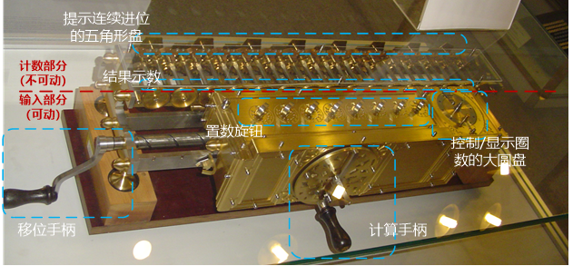
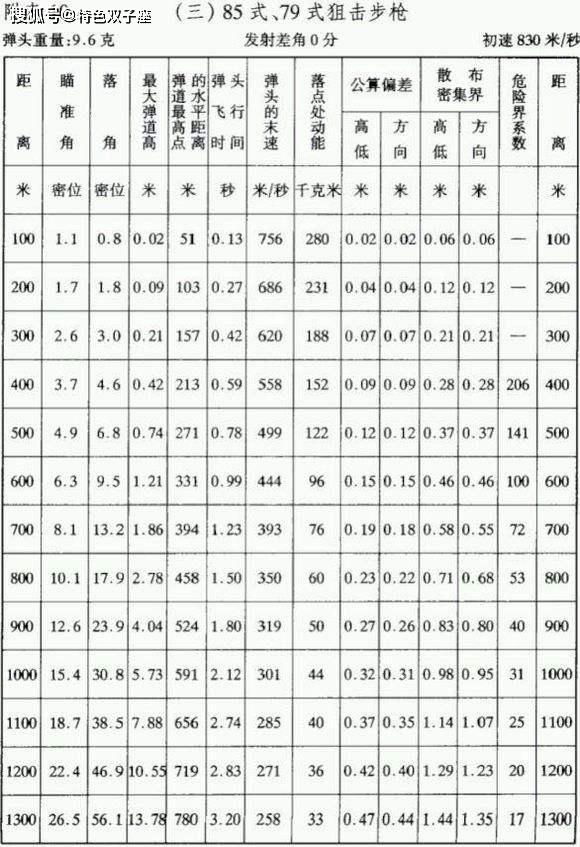
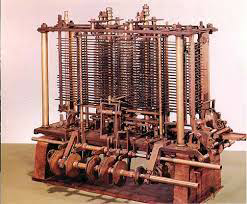
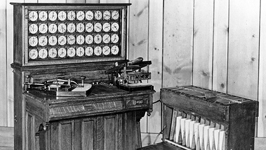

# 计算机早期历史
>随着知识增长与新工具的产生，人工劳力会越来越少——查尔斯•巴比奇
* **算盘**：公认最早的计算设备，由美索不达米亚发明于大约公元前2500年
  * 可手动进行加减运算并存储运算状态
* 星盘（船只在海上计算纬度）、计算尺（计算乘除法）、时钟等
* 最早使用“计算机（computer）”一词的文献来自1613年的一本书，作者为Richard Braithwait，指的是一种职业，而不是机器

* **步进计算器**（Step Reckoner）：由德国博学家戈特弗里德·莱布尼茨建造于1694年
  * 类似于汽车里的**里程表**，不断累加里程数
  * 它有一连串可以转动的**齿轮**，每个齿轮有十个齿，代表数字0到9，每当一个齿轮转过9，它会转回0，同时让旁边的齿轮前进1个齿；做减法时，机器反向运作
  * 步进计算器也能做乘法和除法（实际上只是多个加法和减法），是第一台能做“加减乘除”**全部四种运算**的机器
  * **缺点**：计算时间长，过于昂贵

>让优秀的人浪费时间算数简直侮辱尊严，农民用机器能算得一样准——戈特弗里德·莱布尼茨
* **计算表**（pre-computed tables）：在20世纪以前，大部分人会用预先算好的计算表
  * 在战争期间，出现了**射程表**，炮手可以查环境条件和射击距离，表会告知角度是多少
  * **缺点**：如果改了大炮或炮弹的设计，就要算一张新表，很耗时且会出错

* **差分机**（Difference Engine）和**分析机**（Analytical Engine）：查尔斯•巴比奇在1823年开始建造差分机，并且在建造期间构想了更复杂的分析机，但项目均最终放弃；在1991年，历史学家根据他的草稿做了一个差分机并可以使用
  * 差分机是一个更复杂的机器，能**近似多项式**（多项式描述了几个变量之间的关系），可以用于近似对数和三角函数
  * 分析机不像以前的其他计算设备，是 **“通用计算机”**，它可以做很多事情，不只是一种特定运算，甚至可以给它数据，然后按顺序执行一系列操作；它有**内存**，甚至一个很原始的**打印机**
  * 这种“自动计算机”的概念，计算机可以自动完成一系列操作，是个跨时代的概念，预示着**计算机程序**的诞生
  * 分析机激励了第一代计算机科学家，所以Charles Babbage经常被认为是 **“计算之父”**

* 英国数学家Ada Lovelace（诗人拜伦勋爵和数学家拜伦夫人的独生女）给分析机写了假想的程序，并预言了未来编程语言的诞生，因此Ada被认为是世上第一位**程序员**
>未来会诞生一门全新的，强大的，专为分析所用的语言——艾达•洛夫莱斯
* **打孔卡片制表机**（tabulating machine）：Herman Hollerith发明，以应对1880年代美国人口普查效率低下问题
  * **电动机械结构**：用传统机械来计数，结构类似莱布尼茨的乘法器，但用电动结构连接其他组件
  * **打孔卡**（punch cards）：一种纸卡，上面有网络，用打孔来表示数据；当卡插入机器时，小金属针会移动到卡片上，如果有个地方打孔了，针会穿过孔，泡入一小瓶汞，联通电路，电路会驱动电机，再驱动齿轮
  * 这种机器的速度是手动的10倍左右，使得人口普查在短短两年半内完成

* 企业开始意识到计算机的价值，可以提升劳动力以及数据密集型任务来提升利润；为了满足这一需求，Hollerith成立了制表机器公司，这家公司后来在1924年与其它机械制造商合并，成为了 **“国际商业机器公司”**（The International Business Machines Corporation），简称**IBM**
* 到了1900年代中叶，世界人口的爆炸和全球贸易的兴起，要求更快更灵活的工具来处理数据，为电子计算机的发展奠定基础
---
[Crash Course](https://www.bilibili.com/video/av21376839?from=search&seid=117744052507292533&spm_id_from=333.337.0.0)