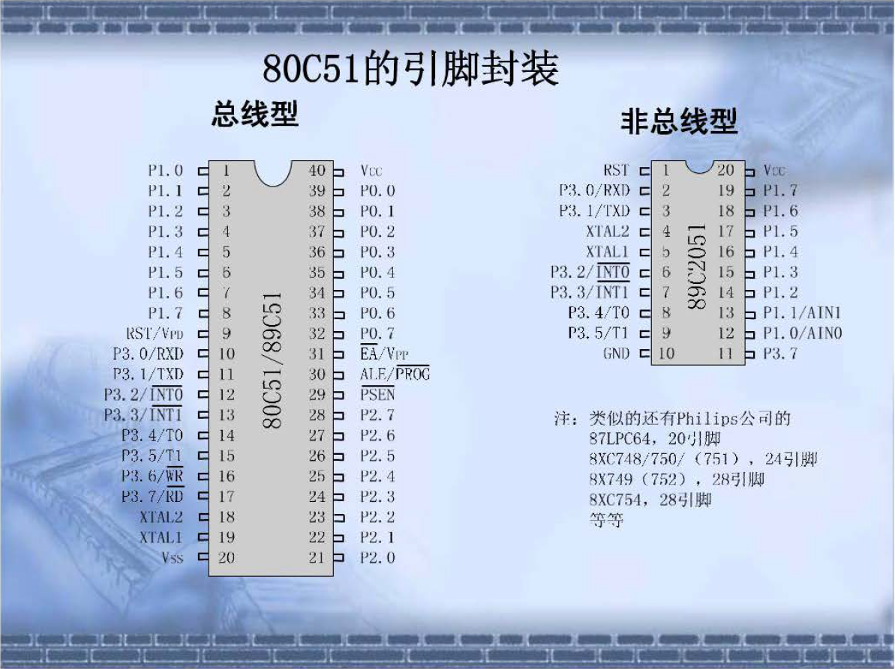
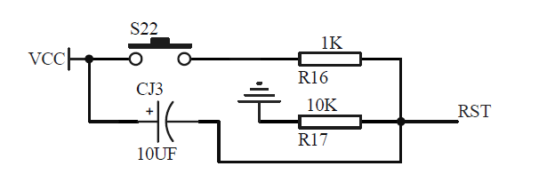
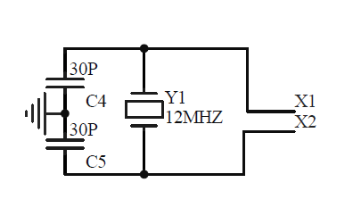

# 第三章
* **引脚**

  * RST/VPD（9）
    * RST：复位端，高电平有效，单片机运行时在此加入大于两个机器周期的高电平，就可以复位
    * VPD：备用电源输入端，当主电源VCC发生故障，将自动接入，保证RAM信息不丢失
按下S22，VCC接通，VRST=5×（10/11）V，达到高电平要求
上电自动复位：通电时CJ3两端产生电压，达到高电平；充完电后通过10K电阻放电
  * P3.0-P3.7（10-17）：有第二功能，需要设置
    * RXD：串行输入口（与计算机连接）
    * PXD：串行输出口（与计算机连接）
    * 开机后先启动（冷启动），计算机输入程序，若没有，则执行原来程序
    * INT0/1：外部中断0/1
    * T0/1：定时器0/1或外部计数输入
    * WR：外部数据存储器的协选通
    * RD：外部数据存储器的主选通
  * XTAL2/1（18-19）：晶振输入端

C4、C5：起振
  * VSS（20）：接地
